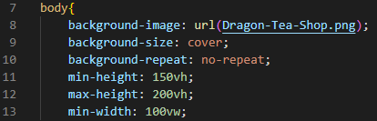

# Designing a Simple Webpage with HTML and CSS

## Required applications
1. A Text Editing Program (Any of the following will work as well as many others).
    - VSCode
    - Notepad
    - Ms Word (Keep in mind that word cannot write CSS files as easily as the others on the list)

## Important Notes
**For this tutorial I will be using VSCode as my text editor and I will be including snippets of code as displayed in VSCode. I will also attempt to explain terms that were not covered in the What is HTML and CSS documents when they should arise.**
If you wish to use the photo that will be used for the background of this tutorial you may find it here [Dragon-in-Teacup](https://pixabay.com/illustrations/ai-generated-dragon-cup-tea-cute-8243919/). Otherwise feel free to use your own image.

### In order to start we must open our text editing software and for our means we will create a new folder.
#### We will start by establishing a folder for our webpage 
1. Open file browser
2. Navigate to where you would like to store your Webpage Tutorial.
3. Right click on an open space and move your mouse to the New drop down.
4. Once on the new drop down select New Folder.
    - 
5. Name the Folder what you would like for this tutorial I will use the name Tutorial Webpage.
    - 

#### Creating Html file
1. Open your text editing software (VScode used for this tutorial).
    - 
2. Click the file button located at the top left and select new file.
    - 
3. Name your Webpage file ensuring that the file type is .html.
    - 
4. Navigate to your pre-established webpage folder and place your new file in the folder.

#### Now that our Webpage's HTML file has been created we will start coding our contents.
1. Declaring our document type using the !Doctype tag.
    - 
2. Create a Html element to establish our coding space and we will nest our Head element with-in the Html element.
    - 
3. Create and place a Meta element and a Title element with-in our Head element.
    - 
4. Create a Body element and nest both a Nav element and Section element.
    - 
5. Create two Div elements with-in the Nav element and one div element with-in the Section element.
    - Give the first Div element in Nav a class by typing &lt;div class="logo"&gt;Logo Name &lt;/div&gt;
6. Create a Div element in the section element we made in step 4 giv it the class content-container.
    - With-in this Div create two more Div elements and give one the class column-left.
    - 
7. Create your content for your Navigation bar using Href tags and place them in your Nav's second div element.
    - I will be using three navigation buttons using tag "a" for my Href elements labeled Home, About, and Contact us.
8. Create your content in your Section element within the div that we have given the class Column-left.
    - I will put some text as well as a button that refers to my imaginary teahouse business using the h1 and p elements to designate my header and paragraphs.
    - 


### Now we will create our CSS file and place it in the same folder as our website
#### For our CSS StyleSheet we will work in a top down fashion as it comes to the classes of our HTML and I will order the properties in alphabetical order for ease of understanding. (All values will be for the tutorial webpage that will be displayed, however any of the properties or values for properties can be changed or re-arranged at your leisure.)
1. For our first step we will create a overall style that will affect the entire webpage using the class '*'.
    - Create your first four properties Box-sizing, Font-family, margin and padding with-in the * class. In order to set your properties you must type them like the following code``` Property: Value; ```
        - For the box-size I will use the value border-box as follows ``` box-size: border-box; ```
        - For the Font-family I will set the value of 'Lucida Sans', 'Lucida Sans Regular', 'Lucida Grande', 'Lucida Sans Unicode', Geneva, Verdana, sans-serif.
        - For the margin I will set a value of 0.
        - For the padding I will set a value of 0.

    

    (Snippets after this point will only show the current element to eliminate redundancy)

2. Create Style for the Body element.
    - Create the Background, max/min height and max width properties in the Body class.
        - For the background property we will write three attributes as follows.
            - ```background-image:``` with the value ``` url('Logo Directory Information'); ```.
            - ```background-size:``` with the value ``` cover;```.
            - ```background-repeat:``` with the value ``` no-repeat; ```.
        - For the min-height property we will set the value to '150vh'.
        - For the max-height property we will set the value to '200vh'.
        - For the min-width property we will set the value to '100vw'.
    
    

3. Create Style for the Logo.
    - Create the color, font, and padding properties in the logo class.
        - For the color property we will set a value of 'black'.
        - For the font property we will write three attributes as follows.
            - ```font-size:``` with the value ``` 2rem; ```.
            - ```font-style:``` with the value ``` italic;```.
            - ```font-weight:``` with the value ``` bold; ```.
        - For the padding property we will set a value of 0 and 1rem as follows ``` padding: 0 1rem; ```.
    
    

4. Create Style for the Navigation bar element.
    - Create the align-item, background, display, height, justification, opacity and padding properties in the nav class.
        - For the align-items property we will set a value of 'center'.
        - For the background property we will set a Hexadecimal value of ```rgb(209, 114, 25)```.
        - For the display property we will set a value of 'flex'.
        - For the height property we will set a value of '80px'.
        - For the justify-content property we will set a value of 'space-between'.
        - For the opacity property we will set a value of '80%'.
        - For the padding property we will set a value of ```0rem calc((100vw-1300px)/2)```.
    
    

5. Create Style for the Navigation buttons
    - Create the color, padding and text properties in the a class.
        - For the color property we will set a value of 'black'.
        - For the padding property we will set a value of '0 1.5rem'.
        - For the text-decoration property we will set a value of 'none'
    
    

6. Create Style for the Navigation buttons when the cursor hovers over.
    - Create the color property in the a:hover class.
        - For the color property we will set a value of 'white'.
    
    

7. Create Style for the Content Container.
    - Create the display, grid-template, height and padding properties in the content container class.
        - For the display property we will set a value of 'grid'.
        - For the grid-template-columns we will set a value of '1fr 1fr'.
        - For the height property we will set a value of '95vh'.
        - For the padding property we will set a value of ```0rem calc((100vw-1300px)/2)```.
    
    

8. Create Style for the Overall Column left.
    - Create the align-item, color, display, flex-direction, justify, padding and text-shadow properties in the column-left class.
        - For the align-items property we will set the value of 'flex-start'.
        - For the color property we will set the value of 'black'.
        - For the display property we will set the value of 'flex'.
        - For the flex-direction property we will set the value of 'column'.
        - For the justify-content property we will set the value of 'center'.
        - For the padding property we will set the value of '0rem 2rem'.
        - For the text-shadow property we will set the value of '.1rem .1rem black'
    
    

9. Create Style for the H1 element in Column left.
    - Create the color, font-size, margin and opacity properties in the h1 class.
        - For the color property we will set the value of 'white'.
        - For the font-size property we will set the value of '5rem'.
        - For the margin-bottom property we will set the value of '1rem'.
        - For the opacity property we will set the value of '95%'.

    
    

10. Create Style for the P element in Column left.
    - Create the color, font, line-height, opacity and margin properties in the p class.
        - For the color property we will set the value of 'white'.
        - For the font-size property we will set the value of '2.7rem'.
        - For the line-height property we will set the value of '1.5'.
        - For the opacity property we will set the value of '95%'
        - For the margin-bottom property we will set the value of '2rem'
    
    
11. Create Style for the button element.
    - Create the background, border, box-shadow, color, cursor, font, mix-blend-mode and padding properties in the button class.
        - For the background property we will set the value of 'white'.
        - For the border property we will write two attributes as follows.
            - ```border:``` with the value ``` none; ```.
            - ```border-radius:``` with the value ``` 50px;```.
        - For the box-shadow property we will set the value of '.5rem .5rem black'
        - For the color property we will set the value of 'black'.
        - For the cursor property we will set the value of 'pointer'.
        - For the font-size property we will set the value of '2rem'.
        - For the mix-blend-mode property we will set the value of 'screen'.
        - For the padding property we will set the value of '1rem 3rem'.
    
    

12. Create Style for the button when the cursor hovers over.
    - Create the background property in the button:hover class.
        - For the background property we will set the value of 'grey'.
        
    
    

13. Create Style for the right side Column.
    - Create the display, justify-content and padding properties in the column-right class.
        - For the display property we will set the value of 'flex'.
        - For the justify-content property we will set the value of 'center'.
        - For the padding property we will set the value of '0rem 2rem'.
    
    

### Link our HTML document to our CSS style sheet
1. Place the link element after the !Doctype declaration.
    - Your code should look like the following ``` <link rel="stylesheet" href="Style.css"/> ```
    - 

     # Congratulations You Have Made Your First Webpage!!!!
<p align = "center"><a href='https://github.com/JusticeGtrrz/FinalProject-DigitalSystems/blob/main/README.md'>Back to README</a></p>
